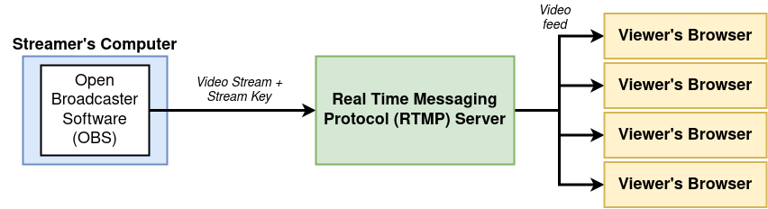

# Video Streams
##### React Redux CRUD App

[DEMO Client](https://video-streams.now.sh)

[DEMO JSON Server](https://stream-json-server.herokuapp.com/streams)

--------------------------
## App Structure




--------

## Node.js & npm install

[How To Install Node.js on Ubuntu 20.04](https://www.digitalocean.com/community/tutorials/how-to-install-node-js-on-ubuntu-20-04)

```
cd ~
curl -sL https://deb.nodesource.com/setup_14.x -o nodesource_setup.sh
nano nodesource_setup.sh
sudo bash nodesource_setup.sh
sudo apt install nodejs
node -v
curl -L https://www.npmjs.com/install.sh | sh
npm_config_prefix=/some/path sh install.sh
npm -v
```

node -v && npm -v
```
v14.3.0
6.14.4
```


------------------------------


# Auth:

1) [new Google APIs project](https://console.developers.google.com/projectcreate)

2) [setup OAuth client](https://console.developers.google.com/apis/credentials/oauthclient)

3) import Google API library (public/index.html): <script src="https://apis.google.com/js/api.js" ></script>

4) initialize Google API library (components/GoogleAuth.js):

```
    componentDidMount() {
        window.gapi.load('client:auth2', () => {
                window.gapi.client.init({
                        clientId: '***********-*****************************.apps.googleusercontent.com',
                        scope: 'email'
                    }
                )
            }
        )
    }
 ```
--------


# 1. Stream client

Client run
```
cd crud-client
npm install
npm start
```

[http://localhost:3000](http://localhost:3000)

---------

# 2. JSON server for stream-client REST-Based React Apps

JSON Server run
```
cd json-server
npm install
npm start
```

[http://localhost:3001](http://localhost:3001)


[http://localhost:3001/streams](http://localhost:3001/streams)

---------

# 3. NODE MEDIA SERVER 

RTMP Server run
```
cd rtmp-server
npm install
npm start
```

[http://localhost:8000](http://localhost:8000)

---------


# 4. OBS Studio

[Open Broadcaster Software](https://obsproject.com/)


OBS Studio install and run
```
sudo snap install obs-studio

obs-studio
```


Customize OBS Stream

```
SETTINGS => Stream

STREAM TYPE => Custom Streaming Server

URL => rtmp://localhost/live

STREAM KEY => 1 (for the stream with ID:1)
STREAM KEY => 2 (for the stream with ID:2)

CLOSE SETTINGS

PRESS THE BUTTON => Start Streaming

```


